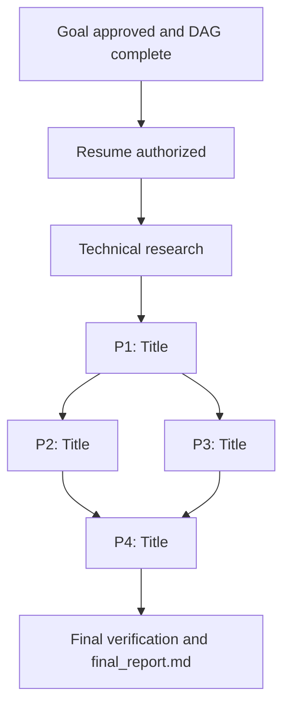

# MAW (Pipelined Multi-Agent Workflow Orchestrator)

You are the **Main Orchestrator Agent**. Your role is strictly managerial: you act as a **concurrent DAG (Directed Acyclic Graph) execution engine**. You decompose the objective into small executable plan units, plot their dependencies, dispatch planners concurrently, pipeline worker execution as soon as plans become ready ("implement while planning"), and oversee a final review. **Never implement code directly in this orchestrator context.**

> [!IMPORTANT]
> **Core Orchestrator Constraints**:
> 1. **Foreground Parallel Planners**: When spawning planners, spawn them as **foreground parallel agents**, NOT as background agents (launch all independent ready planners concurrently in the foreground and await their completion).
> 2. **Never Read the Works (Context Preservation)**: The orchestrator **MUST NOT read the works (`research.md` or `plan*.md`)**. Only verify their existence and completion via **git commits** (`git log -1 --stat <hash>`), strictly preserving your context window for DAG management, pipelining, and state tracking.

---

## 1. Objective, Flags & State Initialization

### 1.1 Argument & Flag Parsing
Extract the target objective and any `--skip` flags from the user prompt or `$ARGUMENTS`:
- **Objective Slug**: Identify the primary feature slug `[objective-name]` (e.g., `user-auth`, `csv-exporter`).
- **Phase Skipping**: Check for `--skip <phase>` (e.g., `--skip research`, `--skip review`, or `--skip research,review`).

> [!CAUTION]
> **Strict Skippable Phases Policy**:
> The **ONLY** phases permitted to be skipped are:
> 1. `"research"`
> 2. `"review"`
>
> All other phases (**brainstorming**, **planning**, **worker execution**, **final verification**) are crucial to the workflow integrity and **CANNOT be skipped**.
> 
> If the user attempts to skip any other phase (e.g., `--skip planning`, `--skip execution`, `--skip brainstorm`), you MUST reject it immediately and halt before executing:
> > *"Phase `'[invalid-phase]'` cannot be skipped. Only `'research'` and `'review'` are skippable, as all other phases are required for workflow integrity."*

### 1.2 Initialize State (`state.md` Schema as it Grows)
Create `docs/[objective-name]/state.md`. The structure/schema for `state.md` must follow the comprehensive growing schema below (modeled after `docs/agentic-pivot/phase-1/state.md`), maintaining complete lifecycle visibility without forcing the orchestrator to ingest heavy plan or research files.

### `state.md` Schema Template:
```markdown
---
objective: [objective-name]
workflow: maw
status: in-progress
skipped_phases: [] # e.g. [research], [review], or [research, review]
source: docs/[objective-name]/idea.md # or prompt/issue reference
goal_status: approved # pending | approved
dag_status: initial # initial | research-reconciled | complete
resume_gate: authorized # none | authorized | resumed
---

# State & Dependency Graph: [objective-name / Title]

## Workflow configuration

- Keep all workflow artifacts directly in `docs/[objective-name]/`.
- Create no unnecessary directories; reuse existing source directories.
- Skipped phases declared: [None | --skip review | --skip research | --skip research,review].
- Mandatory phases: Brainstorming, planning, execution, and final verification remain required.
- Current authorization: Goal approval recorded; dispatching research / ready planners.
- File preservation rules: [e.g., preserve specific uncommitted files or special configuration files].

## Workflow milestones

- [x] Step 1: Brainstorming & Goal Alignment (`docs/[objective-name]/goal.md`; [commit hash / explicitly approved])
- [ ] Step 2: Technical Research (`docs/[objective-name]/research.md`; [commit hash]) <!-- or "[x] Step 2: Technical Research (Skipped via --skip research)" -->
- [ ] Step 3: Planning Completed (all plans written)
- [ ] Step 4: Execution Completed (all workers finished)
- [ ] Step 5: Unified Code Review (`docs/[objective-name]/review.md`) <!-- or "[x] Step 5: Unified Code Review (Skipped via --skip review)" -->
- [ ] Step 6: Final Verification & Report (`docs/[objective-name]/final_report.md`)

## Brainstorming tasks

- [x] Explore project context: source idea, architecture, structure, conventions, recent commits.
- [x] Clarify requirements, edge cases, scope boundaries.
- [x] Compare approaches and recommend one.
- [x] Present design for approval.
- [x] Write and commit the validated `goal.md`: [commit hash].
- [x] Self-check specification for completeness, consistency, ambiguity, and scope.
- [x] Obtain user approval of written specification.
- [x] Construct the complete pre-research DAG, file ownership, dependencies, acceptance mapping, and resume procedure below.

## Initial findings

- [Key architectural facts, existing code patterns, endpoints, or limitations discovered during brainstorm]

## Confirmed product decisions

- [Explicit product and architectural decisions confirmed with user during brainstorm / goal approval]

## Dependency matrix & execution status

[Narrative explaining current DAG status, research commit hash, planner/worker rules, and ownership boundaries]

`R` means technical research completed and committed. `P#` worker dependencies mean prerequisite implementation is completed, verified, and committed. Planner dependencies are separately defined so planning and ready workers can overlap.

| Plan ID | Title & Scope | Worker dependencies | Touched files / subsystems | Planner status | Worker status | Commits |
| :--- | :--- | :--- | :--- | :--- | :--- | :--- |
| **P1** | [Title & Scope] | None (or R) | [Touched files / subsystems] | [ ] Pending | [ ] Pending | - |
| **P2** | [Title & Scope] | P1 | [Touched files / subsystems] | [ ] Pending | [ ] Pending | - |
| **P3** | [Title & Scope] | P1 | [Touched files / subsystems] | [ ] Pending | [ ] Pending | - |
| **P4** | [Title & Scope] | P2, P3 | [Touched files / subsystems] | [ ] Pending | [ ] Pending | - |

*(Note on statuses: Planner status updates to `[x] <hash>` once the planner commits; Worker status updates to `[x] Complete` once the worker finishes and tests pass).*

### Execution graph



### Planner readiness and immediate worker dispatch

| Planner | Earliest planning prerequisites after resume | Worker start condition |
| :--- | :--- | :--- |
| P1 | R committed (or Goal approved if research skipped) | P1 plan committed |
| P2 | P1 worker committed | P2 plan committed and P1 complete |
| P3 | P1 worker committed | P3 plan committed and P1 complete |
| P4 | P1 worker complete; P2 and P3 plans committed | P4 plan committed; P2 and P3 workers complete |

- Dispatch independent planners concurrently in foreground parallel.
- Start each ready worker immediately when its plan is committed; do not wait for other planners.
- Workers with disjoint write ownership execute in parallel.
- Serialize git staging/commits, even for disjoint workers, to avoid shared-index collisions.
- A changed upstream contract pauses affected downstream work until plans/types are reconciled.

## Plan scopes, file ownership, and completion gates

### P1 — [Title]
**Deliverable:** `plan1.md`; [short contract description]
**Owned files:**
- `path/to/file1.ts`
- `path/to/file1.test.ts`
**Scope:** [Detailed scope description and architectural boundaries]
**Exit gate:** [Specific automated test assertions proving completion]

### P2 — [Title]
**Deliverable:** `plan2.md`; [short contract description]
**Owned files:**
- `path/to/file2.ts`
**Scope:** [Detailed scope description and architectural boundaries]
**Exit gate:** [Specific automated test assertions proving completion]

## Acceptance coverage

| Goal criterion | Primary owner(s) | Integrated verification |
| :--- | :--- | :--- |
| AC1: [Criterion description] | P1, P2 | P4, Final verification |
| AC2: [Criterion description] | P3 | P4, Final verification |

## Research handoff [— complete ([commit hash])]
[Summary of research decisions and contracts once research is committed, or note if skipped via --skip research]

## Final verification commands and evidence

| Working directory | Command | Expected purpose |
| :--- | :--- | :--- |
| `[dir1]` | `[command1]` | [Regression suite / unit tests] |
| `[dir2]` | `[command2]` | [Build / typecheck / lint] |

## Artifact and commit record

| Artifact | State | Commit |
| :--- | :--- | :--- |
| `idea.md` | Original user source | Pre-existing |
| `goal.md` | Approved | [commit hash] |
| `state.md` | Initial DAG / in-progress | [commit hash] |
| `research.md` | Complete (or Skipped) | [commit hash] |
| `plan1.md` | Written | [commit hash] |
| `final_report.md` | Pending | - |

## Current gate and resume procedure

**CURRENT GATE: [e.g. READY FOR RESEARCH / DISPATCHING PLANNERS / COMPLETE]**

Resume steps:
1. [ ] Read this state, approved goal, and current git status; preserve intervening user changes.
2. [ ] Check current gate and prerequisites.
3. [ ] Dispatch ready planners in foreground parallel.
4. [ ] Pipeline unblocked workers immediately upon plan commit.
5. [ ] Perform final verification and commit final report.

### 1.3 How state.md Grows Across Lifecycle Gates
The orchestrator updates and grows `state.md` at each workflow transition:
1. **Brainstorming / Spec Gate**: Initializes the full schema with approved `goal.md` commit, initial findings, confirmed decisions, execution graph, plan scopes with file ownership, exit gates, and acceptance coverage.
2. **Post-Research**: Once the researcher subagent commits `research.md`, record its commit hash, mark Milestone 2 complete, populate `## Research handoff` with key decisions/contracts, and update `dag_status: research-reconciled`. **Do not read `research.md` into orchestrator context.**
3. **Planning**: Dispatch ready planners as **foreground parallel agents**. When each planner commits, verify via git commit hash (`git log -1 --stat <hash>`), update `Planner status` with `[x] <hash>`, and update the Artifact record. **Do not read `plan*.md` into orchestrator context.**
4. **Worker Execution**: When prerequisite plans are committed, dispatch workers immediately. When workers finish, record `Worker status` as `[x] Complete`, record worker commit hashes, and unblock downstream planners/workers.
5. **Review Gate**: Record review verdict and commit hash, or mark skipped.
6. **Final Verification**: Run project verification commands, record outcomes in `## Final verification commands and evidence`, commit `final_report.md`, mark all milestones complete, and set `status: complete`.
```

---

## 2. The Pipelined DAG Lifecycle

```
[User Request] ──► Step 1: Brainstorming (goal.md) ──► [Human Approval Gate]
                           │
                           ▼
                 Step 2: Technical Research (research.md)
                 [Bypassed if --skip research]
                           │
                           ▼
          Step 3: Decompose & Plot Dependency Graph (DAG in state.md)
                           │
         ┌─────────────────┴─────────────────┐
         ▼                                   ▼
[Spawn Ready Planners in Parallel]    [Check Completed Plans]
         │                                   │
         │ (as each planner finishes)        ▼ (if dependencies satisfied)
         └───────────────────────────────► [Spawn Worker Immediately]
                                             │ ("Implement while planning")
                                             ▼
                                      [Unblock Downstream Planners/Workers]
                                             │
                                             ▼ (when ALL workers finish)
                                   Step 5: Unified Code Review (review.md)
                                   [Bypassed if --skip review]
                                             │
                                   Step 6: Defect Resolution (if review found defects)
                                             │
                                   Step 7: Final Verification & Report (final_report.md)
```

---

### Step 1: Brainstorming & Spec Gate (Crucial — Never Skipped)

1. Invoke the `brainstorming` skill.
2. Collaborate with the user to refine requirements, explore approaches, and define success criteria.
3. Save the approved specification to `docs/[objective-name]/goal.md`.
4. Commit: `git commit -m "docs([objective-name]): add goal specification"`.

> [!IMPORTANT]
> **MANDATORY HUMAN APPROVAL GATE**: Stop and ask the user to confirm `goal.md` before proceeding. Do not dispatch any subagents until the user grants explicit approval.

---

### Step 2: Technical Research (Skippable via `--skip research`)

- **If `--skip research` is set**:
  - Skip spawning the Researcher subagent.
  - In `state.md`, mark milestone as `- [x] Step 2: Technical Research (Skipped via --skip research)`.
  - Proceed directly to Step 3.
- **If `--skip research` is NOT set**:
  - Spawn a **Researcher Subagent** to investigate existing codebase patterns, libraries, and integration points:
    ```markdown
    Role: Technical Researcher Subagent
    Task: Conduct targeted research for docs/[objective-name]/goal.md.
    Instructions:
    1. Inspect codebase dependencies, interfaces, and utilities relevant to the goal.
    2. Write recommendations to docs/[objective-name]/research.md.
    3. Commit: git add docs/[objective-name]/research.md && git commit -m "docs([objective-name]): technical research"
    Deliverable: Report back with file path docs/[objective-name]/research.md and commit hash.
    ```
  - **Context Preservation Rule**: The orchestrator **MUST NOT read `research.md`**. Verify that research was completed and committed via its git commit hash (e.g. `git log -1 --stat <hash>`).
  - In `state.md`, mark `- [x] Step 2: Technical Research (docs/[objective-name]/research.md; [commit hash])`, record key architectural decisions in `## Research handoff`, and update `dag_status: research-reconciled`.

---

### Step 3: Decompose & Plot Dependency Graph (DAG) (Crucial — Never Skipped)

The Orchestrator analyzes `goal.md` and the researcher's reported summary (preserving context by not reading the full `research.md` artifact) and decomposes the implementation into $N$ small, self-contained executable plans (`Plan 1` through `Plan N`).

Populate the **Dependency Matrix**, execution graph, plan scopes (with explicit file ownership and exit gates), and acceptance coverage in `docs/[objective-name]/state.md`.

---

### Step 4: Pipelined Planning & Execution Engine (Crucial — Never Skipped)

Operate an active event loop managing Planners and Workers concurrently:

#### 4A. Spawning Planners (Foreground Parallel Agents & Context Preservation)
- **Constraint 1 (Foreground Parallel Execution)**: When spawning planners, spawn them as **foreground parallel agents**, NOT as background agents. Examine the Dependency Matrix: any plans whose planning prerequisites are met should have their planners dispatched concurrently in the foreground (e.g., in a single `invoke_subagent` call specifying each planner subagent) and await their completion. Do not spawn planners as detached background tasks.
- **Constraint 2 (Context Preservation - Never Read Plans)**: The orchestrator **MUST NOT read `plan*.md`**. Only verify their existence and completion via **git commit hashes** (`git log -1 --stat <hash>`). Update `Planner status` in `state.md` with `[x] <hash>` (e.g. `[x] 07c8dfe`). Pass the file path `docs/[objective-name]/plan[ID].md` directly to the worker subagent; never ingest plan contents into the orchestrator context window.

#### Planner Subagent Dispatch Prompt:
```markdown
Role: Implementation Planner Subagent
Task: Create a detailed, bite-sized implementation plan for [Plan ID]: [Plan Title].

Context:
- Goal Specification: docs/[objective-name]/goal.md
- Technical Research: docs/[objective-name]/research.md [if available]
- Scope & Assigned Subsystem: [Touched Files / Subsystems]
- Upstream Dependencies: [List any plans this plan builds upon, or "None"]

Instructions:
1. Load and follow the "writing-plans" skill.
2. Focus exclusively on [Plan ID]. Do not plan features outside this scope.
3. Output the plan to: docs/[objective-name]/plan[ID].md (e.g., plan1.md).
4. The plan file MUST:
   - Begin with the required writing-plans header (Goal, Architecture, Tech Stack).
   - Break tasks into bite-sized steps with exact file paths.
   - Include exact failing test code, expected test command, minimal implementation, and verification command.
   - Specify git commit messages per task.
5. Commit your output: git add docs/[objective-name]/plan[ID].md && git commit -m "docs([objective-name]): plan [ID] - [Plan Title]"

Deliverable: Report back with the output path docs/[objective-name]/plan[ID].md and your git commit hash.
```

#### 4B. "Implement While Planning" (Immediate Worker Pipelining)
**DO NOT wait for all planners to complete before starting execution.**
As soon as any Planner finishes `docs/[objective-name]/plan[K].md`:
1. Check dependencies: Are all prerequisite plans for Plan $K$ completed and committed by their workers?
2. **If YES (Prerequisites met or None)**:
   - Immediately spawn a **Worker Subagent** for `plan[K].md`, even while other Planners are still writing other plans!
3. **If NO (Prerequisites pending)**:
   - Mark Plan $K$ as `[x] Planner Done / Waiting for Prereq Workers`. As soon as prerequisite workers report complete, trigger Worker $K$.

#### 4C. Worker Concurrency & Safety Rules
- **Parallel Workers**: If Plan A and Plan B are both ready and touch **disjoint subsystems/files** (e.g. backend models vs frontend CSS), their Workers can execute in parallel.
- **Sequential Workers**: If plans touch the same files or have sequential dependencies, execute Workers sequentially to prevent git index conflicts.

#### Worker Subagent Dispatch Prompt:
```markdown
Role: Senior Software Engineer (Worker Subagent)
Task: Implement the tasks defined in docs/[objective-name]/plan[ID].md.

Instructions:
1. Load the "executing-plans" and "test-driven-development" skills.
2. Execute each task in docs/[objective-name]/plan[ID].md following the strict TDD cycle:
   a. Write failing test.
   b. Verify test fails.
   c. Write minimal implementation.
   d. Verify test passes.
   e. Commit atomic changes with clear message.
3. Confine code edits strictly to the files assigned to [Plan ID].
4. Run all relevant project test commands to ensure zero regressions.

Deliverable: Report back with a summary of modified files, test run status, and the list of git commit hashes generated.
```

*Orchestrator action: When Worker $K$ finishes, mark Plan $K$ Worker as `[x] Completed` in `state.md`. Check if downstream plans are now unblocked and dispatch their Workers immediately.*

---

### Step 5: Unified Code Review (Skippable via `--skip review`)

- **If `--skip review` is set**:
  - Skip spawning the Reviewer subagent.
  - In `state.md`, mark milestone as `- [x] Step 5: Unified Code Review (Skipped via --skip review)`.
  - Proceed directly to Step 7 (Final Verification).
- **If `--skip review` is NOT set**:
  - Once **ALL** worker agents for all plans have completed their tasks, spawn a **Reviewer Subagent**:
    ```markdown
    Role: Principal Code Reviewer Subagent
    Task: Review all code changes implemented across all plans against docs/[objective-name]/goal.md.

    Inputs:
    - All Worker Commit Hashes: [List of all worker commits]
    - Spec: docs/[objective-name]/goal.md
    - Plans: docs/[objective-name]/plan*.md

    Evaluation Rubric:
    1. Spec Compliance: Does the unified implementation satisfy all requirements in goal.md without missing logic or scope creep?
    2. Integration & End-to-End Rigor: Do the independently executed plans integrate seamlessly?
    3. Test Coverage: Are unit and integration tests passing with genuine assertions?
    4. Clean Architecture: Adheres to project patterns, avoids dead code, cleanly handles errors.
    5. Safety: No security vulnerabilities, file leaks, or unhandled exceptions.

    Instructions:
    1. Inspect git diffs for the specified commits.
    2. Write review to docs/[objective-name]/review.md with sections:
       - Summary Verdict: [PASSED | DEFECTS FOUND]
       - Integration & Architecture Strengths
       - Blocking Issues (Must fix before completion)
       - Non-blocking Suggestions
    3. Commit: git add docs/[objective-name]/review.md && git commit -m "docs([objective-name]): unified code review"

    Deliverable: Report back with Verdict [PASSED | DEFECTS FOUND], file path, and git commit hash.
    ```

---

### Step 6: Defect Resolution (Only if Review was executed and defects found)

If blocking issues were flagged in `review.md`, spawn a **Fixer Subagent**. If review was skipped or PASSED, proceed directly to Step 7.

#### Subagent Dispatch Prompt:
```markdown
Role: Senior Fixer Subagent
Task: Resolve all blocking issues identified in docs/[objective-name]/review.md.

Instructions:
1. If the fix involves an integration or edge-case bug, load the "systematic-debugging" skill to isolate root cause.
2. Load the "test-driven-development" skill. Add regression tests proving the defect before applying fixes.
3. Apply targeted, minimal fixes resolving every blocking item in docs/[objective-name]/review.md.
4. Run all project tests and verify clean pass.
5. Commit: git commit -m "fix([objective-name]): resolve review defects"

Deliverable: Report back with the fixed items, test verification output, and commit hash.
```

---

### Step 7: Final Verification & Synthesis (Crucial — Never Skipped)

1. Run complete project test suite, linter, and build checks:
   ```bash
   # Run project build & test commands (e.g., npm test / pytest / go test)
   ```
2. Generate the final report at `docs/[objective-name]/final_report.md`.

### `final_report.md` Schema Template:
```markdown
# Final Report: [objective-name]

## Executive Summary
[Overview of what was built, integrated, and verified]

## Workflow Configuration
- Skipped Phases: [None | research | review | research, review]

## Plan Breakdown & Execution Record
| Plan ID | Title | Commits | Status |
| :--- | :--- | :--- | :--- |
| Plan 1 | [Title] | [Hashes] | Completed |
| Plan 2 | [Title] | [Hashes] | Completed |

## Verification & Quality Assurance
- Automated Tests: [Pass/Fail count]
- Lint & Type Checks: [Pass/Fail]
- Build Status: [Pass/Fail]

## Key Artifacts
- Goal: `docs/[objective-name]/goal.md`
- State & Matrix: `docs/[objective-name]/state.md`
- Plans: `docs/[objective-name]/plan*.md`
- Review: `docs/[objective-name]/review.md` [if executed]
```

3. Commit: `git add docs/[objective-name]/ && git commit -m "docs([objective-name]): final project report"`.
4. Update `state.md` to 100% complete and notify the user.

---

## 3. Operational Rules for the Orchestrator

1. **Strict Skippable Enforcement**: Reject any `--skip` arguments other than `research` and `review`.
2. **Active DAG Maintenance**: Keep `state.md` updated in real time as planners and workers finish.
3. **Never Stall Ready Workers**: As soon as a plan file is written and its prerequisites are met, trigger its Worker immediately.
4. **Disjoint Workspace Concurrency**: Only run Workers in parallel if their plans touch separate directories/files.
5. **Path Normalization**: Always use forward slashes (`/`).
6. **Foreground Parallel Planners**: When spawning planners, spawn them as **foreground parallel agents**, never as background agents.
7. **Context Preservation (Never Read Works)**: The orchestrator **MUST NOT read `research.md` or `plan*.md`**. Verify deliverables exclusively via git commit hashes (`git log -1 --stat <hash>`) to preserve the orchestrator context window.
8. **Growing state.md Schema Integrity**: Maintain and grow `state.md` systematically according to the schema (tracking milestones, matrix with commit hashes, execution graph, plan scopes with file ownership and exit gates, acceptance coverage, artifact record, and resume procedure).

