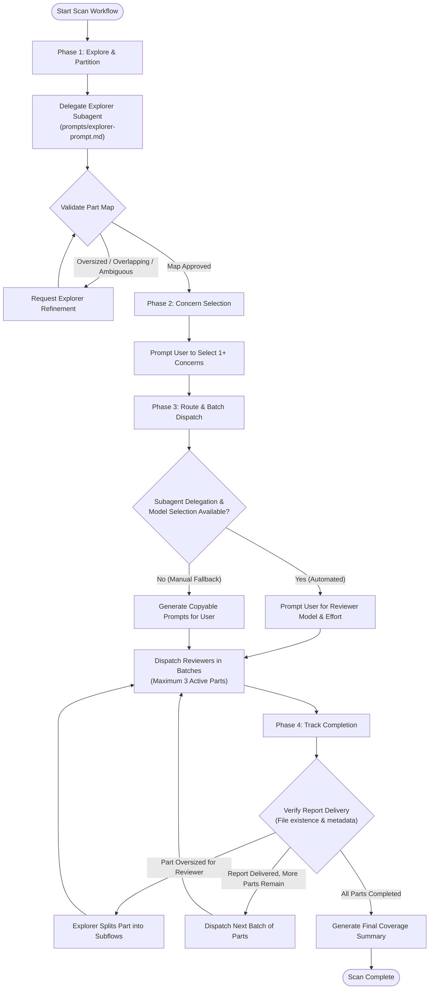

# Scan Codebase

Coordinate an end-to-end, parallel, concern-specific review of an existing codebase. An **Explorer** subagent maps and partitions the repository into cohesive, context-sized parts; independent **Reviewer** subagents inspect assigned parts against user-selected concerns; and the **Orchestrator** (main agent) oversees batch dispatch, execution routing, and delivery verification.

> [!IMPORTANT]
> **Strict Orchestrator Isolation:** The orchestrator manages *process and delivery only*. The main agent **MUST NEVER** open, read, quote, summarize, merge, or validate reviewer reports, nor review implementation code directly. This keeps the orchestrator's context window pristine for workflow management.

---

## Architecture & Responsibilities

| Role | Primary Responsibility | Strict Boundaries & Invariants |
| :--- | :--- | :--- |
| **Orchestrator** *(Main Agent)* | Coordinates workflow, prompts user for concerns and models, dispatches batches, tracks delivery, writes final coverage summary. | **Never** reviews code. **Never** reads, summarizes, or quotes reviewer reports. |
| **Explorer** *(Subagent)* | Surveys repository structure, defines $N$ cohesive functional parts, maps path ownership, and identifies coverage gaps. | **Never** audits code for concerns. **Never** writes reports or modifies files. |
| **Reviewer** *(Subagent per Part)* | Deeply inspects owned code for selected concerns, traces execution paths, and writes one standalone report. | **Never** modifies source code. Replies to orchestrator **only** with delivery status and report path. |

---

## Workflow Lifecycle



---

## Phase 1: Explore and Partition

The orchestrator discovers repository boundaries and delegates an Explorer to map the codebase into cohesive review units.

### 1. Identify Repository Context
- Determine the repository root path.
- Check for applicable instructions (e.g., `GEMINI.md`, `AGENTS.md`, `README.md`, or architecture docs).

### 2. Delegate the Explorer
- Delegate a single explorer subagent using [`prompts/explorer-prompt.md`](prompts/explorer-prompt.md).
- Provide the explorer with:
  - Repository root path.
  - Any explicit user-specified scope, inclusions, or exclusions.
- **Reference Mechanism:** Tag or attach [`prompts/explorer-prompt.md`](prompts/explorer-prompt.md) using the harness's native file-attachment mechanism (or provide its relative path). **Do not** duplicate the prompt text into the delegation call.
- *Fallback for single-chat harnesses:* If subagent delegation is not supported, provide the user with a copyable explorer assignment referencing `prompts/explorer-prompt.md` and await their return of the resulting part map before continuing.

### 3. Validate the Part Map
The explorer returns a structured part map where each part has:
- A unique, lowercase kebab-case `part_name` slug (safe for filenames).
- A one-sentence statement of what capability or behavior it accomplishes from entry point/caller contract to outcome.
- Explicitly owned paths or glob patterns.
- Estimated size (file count, approximate lines/bytes).
- Key entry points and adjacent context dependencies.
- Identified cross-part interfaces and shared code ownership.
- Documented coverage gaps or ambiguities.

#### Partitioning Criteria Checklist
Before proceeding, the orchestrator validates that the part map satisfies:
- [ ] **Identifiable Purpose:** Every part owns a complete behavior or a distinct shared responsibility with a defined contract.
- [ ] **Context Budgeting:** Sized so a reviewer can inspect owned code, relevant tests, and adjacent contracts within a single context window with ample reasoning capacity remaining.
- [ ] **Natural Boundaries:** Grouped by coherent features, services, or modules—**never** by arbitrary line counts, file-size chunks, or alphabetical file lists.
- [ ] **Single Ownership:** Every in-scope file belongs to exactly one part. Shared code has one primary owner; other reviewers read it solely as context.
- [ ] **Refinement Loop:** If any part is oversized, purposeless, missing, or overlapping, instruct the explorer to refine and resubmit the map.

---

## Phase 2: Select Concerns

Before dispatching reviewers, present the available review concerns to the user. **Do not launch reviewers until the user has explicitly selected at least one concern.**

| Concern | Focus & Scope | Guidelines Reference |
| :--- | :--- | :--- |
| **Dead Code** | Unreachable routines, unreferenced exports, stale feature flags, orphaned files. | [`concerns/dead-code.md`](concerns/dead-code.md) |
| **Hanging Code** | Unfinished implementations, active TODO stubs, unhandled events, disconnected flows. | [`concerns/hanging-code.md`](concerns/hanging-code.md) |
| **Bloated Code** | Unnecessary indirection, duplicated business logic, oversized god-routines. | [`concerns/bloated-code.md`](concerns/bloated-code.md) |
| **Redundant Checks** | Repeated guards, dominated conditionals, dead branches across caller/callee boundaries. | [`concerns/redundant-checks.md`](concerns/redundant-checks.md) |
| **Code Quality** | Correctness, runtime exceptions, security vulnerabilities, performance traps, missing edge-case tests. | [`concerns/code-quality.md`](concerns/code-quality.md) |

> [!NOTE]
> All reviewers in a given run receive the exact same set of selected concerns. Only attach or tag the concern files selected by the user.

---

## Phase 3: Choose Execution Route & Batch Dispatch

Check the host harness's capabilities to determine whether automated subagent delegation or manual prompt generation is required.

### 1. Harness Capability Matrix

| Capability Detected | Operational Flow |
| :--- | :--- |
| **Subagents + Model Selection** | 1. Prompt user to choose the reviewer model from available options.<br/>2. If effort level (`low`, `medium`, `high`) is supported, prompt user for desired effort; otherwise use default.<br/>3. Dispatch reviewer subagents in batches of **up to 3 active parts** concurrently. |
| **Subagents Only (Fixed Model)** | Dispatch reviewer subagents in batches of **up to 3 active parts** using the default model. |
| **No Subagent Support** | 1. Prepare standalone reviewer prompts in batches of **up to 3 parts** for the user to copy into separate chats.<br/>2. Wait for the user to confirm completion of the batch before preparing the next batch. |

### 2. Reviewer Assignment Specification

Each reviewer assignment must be concise and include **only**:
1. Tag, attachment, or path to [`prompts/reviewer-prompt.md`](prompts/reviewer-prompt.md).
2. Tags, attachments, or paths to **only** the selected concern files.
3. Repository root directory.
4. Part metadata: `part_name`, one-sentence purpose/contract, owned paths, and explorer-provided context notes.
5. Target report destination: `reviews/<Month D>/<part_name>-review.md`.

> [!CAUTION]
> **Do not inline prompt templates:** Pass file references to prompt and concern files; do not paste their full text into delegation messages.

### 3. Report Destination & Date Directory Rules
- Save all reports under the repository root at:
  `reviews/<Month D>/<part_name>-review.md`
  *(e.g., `reviews/September 25/auth-service-review.md`)*
- Use the identical date folder for every part in a single run.
- **Collision Handling:** If `reviews/<Month D>/` already exists from an earlier run on the same date, increment to a numbered sibling: `reviews/<Month D> (2)/`, then `reviews/<Month D> (3)/`, preserving prior review artifacts.

### 4. Batch Throttling
- Dispatch at most **three (3) active reviewer parts** at any one time.
- When fewer than 3 parts remain, assign only the remainder.
- Once a reviewer completes delivery, dispatch the next pending part.

---

## Phase 4: Track Completion & Delivery Verification

Reviewers inspect their assigned code, generate a structured markdown report, and notify the orchestrator.

### 1. Reviewer Contract & Report Structure
Every reviewer writes exactly one report at its assigned path formatted as:
- **Header:** Verdict (`GOOD`, `DECENT`, `BAD`) followed by categorized concern ratings (`NONE`, `MINIMAL`, `MODERATE`, `CRITICAL`).
- **Body:** Scope, confirmed findings with `path:line` citations, open questions, and validation coverage.
- **Reviewer Status Reply:** Upon completion, the reviewer replies **only** with its status, `part_name`, and verified report path. Reviewers **must not** include finding details in their chat reply.

### 2. Delivery Verification Protocol
- Verify report delivery via file existence and file size/metadata checks.
- When working across isolated chat windows without a shared filesystem, ask the user to confirm the report exists at the assigned destination.
- **The Golden Rule:** **NEVER open, read, summarize, merge, or quote report contents in the main agent.**

### 3. Handling Reviewer Issues
- **Oversized Part:** If a reviewer reports that a part exceeds its context window, invoke the explorer to split that part into smaller, non-overlapping subflows, and reassign the resulting parts.
- **Execution Failure / Missing Report:** Reassign the part or ask the user to re-run the prompt. Do not mark any part complete simply because execution began.

### 4. Final Orchestrator Delivery Summary
Once all mapped parts have verified delivered reports, publish a concise **Coverage and Delivery Summary**:

```markdown
# Codebase Scan Delivery Summary

- **Repository Root:** `<path>`
- **Run Date & Destination:** `reviews/<Month D>/`
- **Selected Concerns:** `<List of selected concerns>`
- **Total Parts Reviewed:** `<N>`

## Delivered Review Reports
| Part Name | Purpose | Report Path | Status |
| :--- | :--- | :--- | :--- |
| `auth-service` | Handles JWT validation and session lifecycle | `reviews/September 25/auth-service-review.md` | Verified |
| `billing-worker` | Processes webhook events from payment gateway | `reviews/September 25/billing-worker-review.md` | Verified |

## Coverage Notes & Explorer Limitations
- <Any gaps, exclusions, or unmapped assets identified by the explorer>
```

> [!NOTE]
> This is strictly a delivery and coverage confirmation. Do not synthesize verdicts, aggregate scores, or provide qualitative assessments of the codebase in the orchestrator. Interpretation is left to the user.

---

## Operational Boundaries & Guardrails

- **Read-Only Source Guarantee:** The scan is strictly read-only regarding repository source code, build scripts, and configuration.
- **Allowed File Writes:** The only permitted write operations are the markdown review reports inside `reviews/<Month D>/`.
- **Side-Effect Prohibition:** Never execute arbitrary application code, database migrations, package installations, git commits, branches, or PR creation.
- **Scope Discipline:** Exclude vendor trees (`node_modules/`, `vendor/`), virtual environments, build artifacts (`dist/`, `build/`), and internal `.git/` metadata unless explicitly instructed by the user.

---

## Reference Resources & Examples

- **Prompt Templates:**
  - Explorer Assignment: [`prompts/explorer-prompt.md`](prompts/explorer-prompt.md)
  - Reviewer Assignment: [`prompts/reviewer-prompt.md`](prompts/reviewer-prompt.md)
- **Reference Implementations:**
  - Sample Part Map: [`examples/sample-part-map.md`](examples/sample-part-map.md)
  - Sample Review Report: [`examples/sample-review-report.md`](examples/sample-review-report.md)
- **Concern Catalogs:**
  - Dead Code: [`concerns/dead-code.md`](concerns/dead-code.md)
  - Hanging Code: [`concerns/hanging-code.md`](concerns/hanging-code.md)
  - Bloated Code: [`concerns/bloated-code.md`](concerns/bloated-code.md)
  - Redundant Checks: [`concerns/redundant-checks.md`](concerns/redundant-checks.md)
  - Code Quality: [`concerns/code-quality.md`](concerns/code-quality.md)

